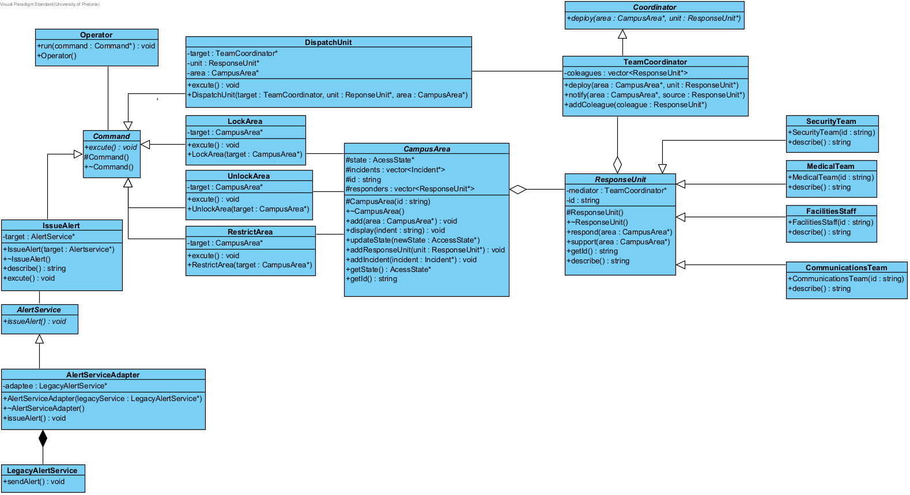
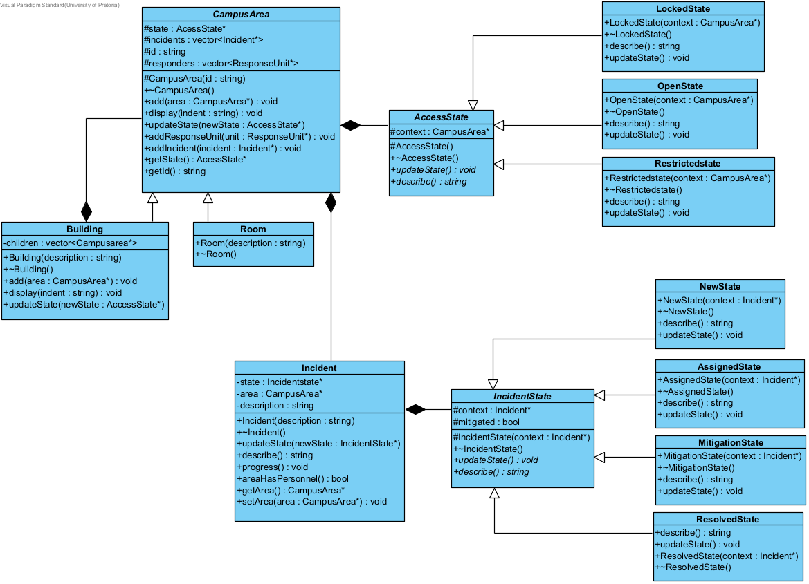
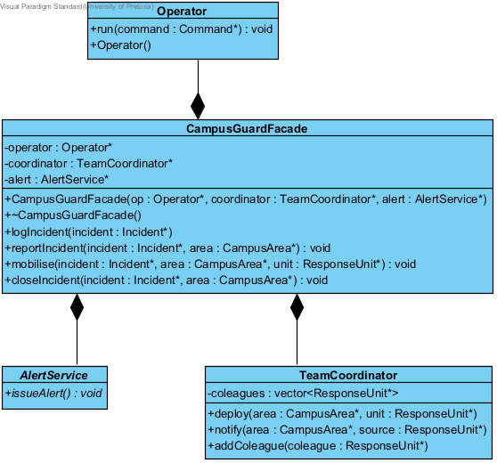
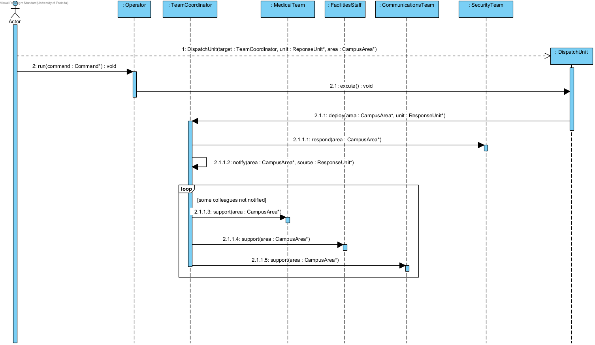
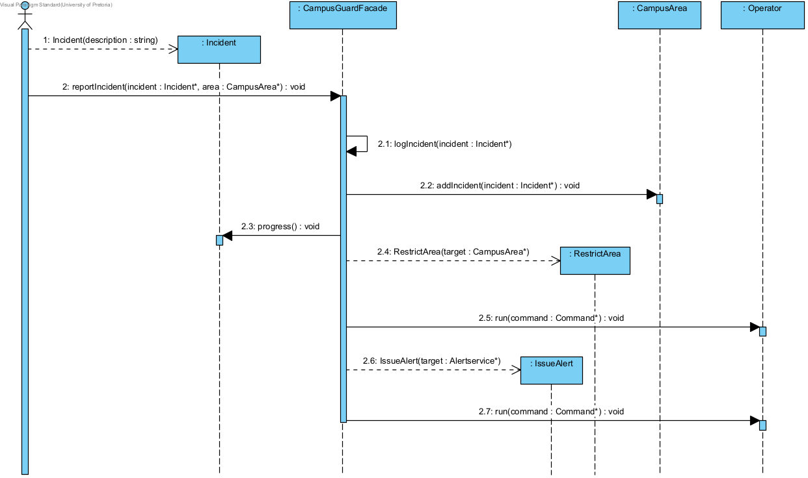
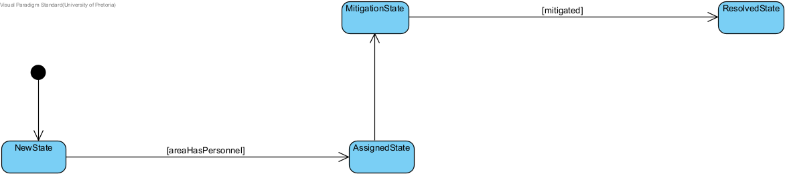

---
geometry:
  - top=1in
  - bottom=1in
  - left=1in
  - right=1in
header-includes:
  - \usepackage{float}
  - \makeatletter\def\fps@figure{H}\makeatletter
---

__Task 1: Analyse the Scenario and Design the System__

_a. Incidence-Response responsibilities_

CampusGuard supports an incident from registration until it is closed. An incident is registered against a campus area in the `New` state. The operator can then:

  - issue a public alert;
  - dispatch a response unit to that area;
  - change access to the area (lock, unlock, or restrict).

Dispatching a unit coordinates the other response services (security, medical, facilities, communications) so those units do not call each other. Incident status and area access change through defined states; invalid changes are refused.

A high-level workflow can run several of these steps in sequence (activate or resolve). Alerts leave the system through the existing legacy alert interface. When the incident is `Resolved`, the area can be unlocked and an all-clear issued.

_b. UML Diagram_

_c. GoF Participants in named patterns_

_I. Command_

- Invoker: `Operator`
- Receiver: `CampusArea, TeamCoordinator, AlertService`
- Command: `Command`
- ConcreteCommand: `LockArea, UnlockArea, RestrictArea, DispathUnit,IssueAlert`

_II. Mediator_

- Mediator: `Coordinator`
- ConcreteMediator: `TeamCoordinator`
- Colleague: `ResponseUnit`
- ConcreteColleague: `CommunicationsTeam, SecurityTeam, FacilitiesTeam, MedicalTeam`

_III. Facade_

- Facade: CampusQuardFacade

_IV. Adapter_

- Adapter: `AlertServiceAdapter`
- Adaptee: `LegacyAlertService`
- Target: `AlertService`

_V. State_

- State: `IncidentState, AccessState`
ConcreteState: `LockedState, OpenState, RestrictedState, NewState, AssignedState, MitigationState, ResolvedState`
- Context: `CampusArea, Incident`

_VI. Composite_

- Component: `CampusArea`
- Composite: `Building`
- Leaf: `Room`

__Task 2: Implement the Integrated Model__

__Task 4: UML Diagram Portfolio__

_Class diagram: Command, Mediator and Adapter_

_Class diagram: areas, access state and incident states_

_Class diagram: Facade, operator, alert service and team coordinator_

_Sequence diagram: dispatch a unit (Command and Mediator)_

_Sequence diagram: report an incident (Facade)_

_State diagram: incident lifecycle_

